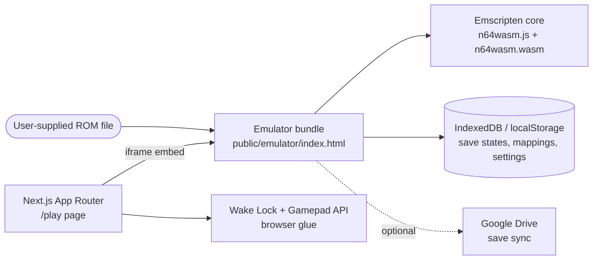

# n64-web

Next.js web shell for **N64.wasm** — a SIMD-powered, browser-native Nintendo 64 emulator. A TrickBook project.


## Overview

`n64-web` is the hosting layer for the N64.wasm emulator. The app itself is intentionally thin: it provides routing, theming, and browser-platform glue (wake lock, gamepad status), and embeds the static emulator bundle produced by the sibling [`n64-wasm`](https://github.com/wbaxterh/n64-wasm) repo.

What it does today:

- **`/` → `/play`** — the root route redirects straight to the player.
- **`/play`** (`src/app/play/page.tsx`) — renders the retro-styled chrome and embeds the emulator via `<iframe src="/emulator/index.html">` with `gamepad; autoplay; fullscreen` permissions. Acquires a Screen Wake Lock during gameplay so the display doesn't dim mid-run.
- **`GamepadStatus`** (`src/components/GamepadStatus.tsx`) — fixed HUD indicator driven by the Gamepad API (`gamepadconnected` / `gamepaddisconnected`), so you can see at a glance whether a controller is live.
- **`public/emulator/`** — the vendored N64.wasm bundle: the Emscripten core (`n64wasm.js` / `n64wasm.wasm`), emulator UI (`script.js`, `index.html`), input and gamepad-mapping wizard, game library, ROM header parser, Google Drive save sync, and an AudioWorklet audio path.

**ROMs are not included and never will be.** The ROM list ships empty; to play, use your own legally obtained ROM (`.z64` / `.n64` / `.v64`) loaded through the emulator's file picker. Save states and settings persist locally in the browser (IndexedDB / `localStorage`).

There is also a work-in-progress native React embed (`src/components/N64Emulator.tsx`) that loads the wasm core directly onto a canvas with drag-and-drop ROM loading — it is not yet wired into any route and expects assets under `/n64/` that are not currently published.

## Architecture



### Cross-origin isolation

`next.config.ts` sets `Cross-Origin-Opener-Policy: same-origin` on every route. `Cross-Origin-Embedder-Policy` is intentionally **disabled for now** — enabling it is a prerequisite for `SharedArrayBuffer` / pthreads, at which point the emulator's audio path upgrades from ScriptProcessor to a dedicated AudioWorklet thread (`script.js` already feature-detects `crossOriginIsolated` and upgrades automatically). Flip the commented-out COEP header when the wasm core is built with threading support.

## Getting Started

**Prerequisites:** Node.js ≥ 20.9 (required by Next.js 16).

```bash
npm install
npm run dev
```

Open [http://localhost:3000](http://localhost:3000) — you'll be redirected to `/play`.

Production build:

```bash
npm run build
npm start
```

## Scripts

| Script | Command | Description |
| --- | --- | --- |
| `dev` | `next dev` | Local dev server with HMR |
| `build` | `next build` | Production build |
| `start` | `next start` | Serve the production build |
| `lint` | `eslint` | Lint the codebase |

## Project Structure

```
n64-web/
├── next.config.ts            # COOP header; COEP reserved for future pthreads/SAB
├── src/
│   ├── app/
│   │   ├── layout.tsx        # Root layout, JetBrains Mono, site metadata
│   │   ├── page.tsx          # /  → redirect to /play
│   │   ├── play/page.tsx     # Player shell: iframe embed, wake lock, footer
│   │   └── globals.css
│   ├── components/
│   │   ├── GamepadStatus.tsx # Gamepad API connection HUD
│   │   └── N64Emulator.tsx   # WIP native canvas embed (not yet routed)
│   └── styles/
│       └── n64.css           # Retro theme tokens (CSS variables)
└── public/
    └── emulator/             # Vendored N64.wasm build (from n64-wasm repo)
        ├── index.html        # Emulator UI entry point
        ├── n64wasm.js/.wasm  # Emscripten core
        ├── script.js         # Emulator app logic, save states (IndexedDB)
        ├── input_controller.js, gamepad-wizard.js
        ├── game-library.js, rom-parser.js, romlist.js
        ├── google-drive.js   # Optional cloud save sync
        └── audio-worklet.js, settings.js, assets.zip
```

To update the emulator, rebuild in `n64-wasm` and copy the output into `public/emulator/`.

## Related Repos

| Repo | Purpose |
| --- | --- |
| [n64-wasm](https://github.com/wbaxterh/n64-wasm) | The emulator core — compiled to WebAssembly via Emscripten; source of the `public/emulator/` bundle |
| [n64-docs](https://github.com/wbaxterh/n64-docs) | Docusaurus documentation site ([n64.weshuber.com](https://n64.weshuber.com)) |
| n64-mods | Modding scripts and assets for Tony Hawk's Pro Skater on N64 (local repo) |

## License

Copyright © Wes Huber. All rights reserved.

This is proprietary software; no license is granted for use, copying, modification, or distribution. This project does not distribute game ROMs or any Nintendo intellectual property.
